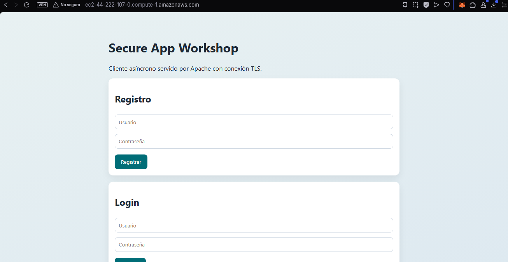
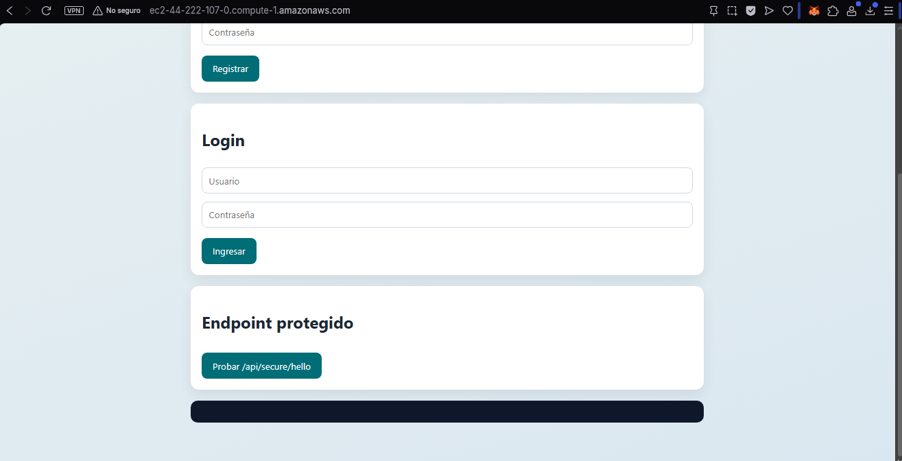
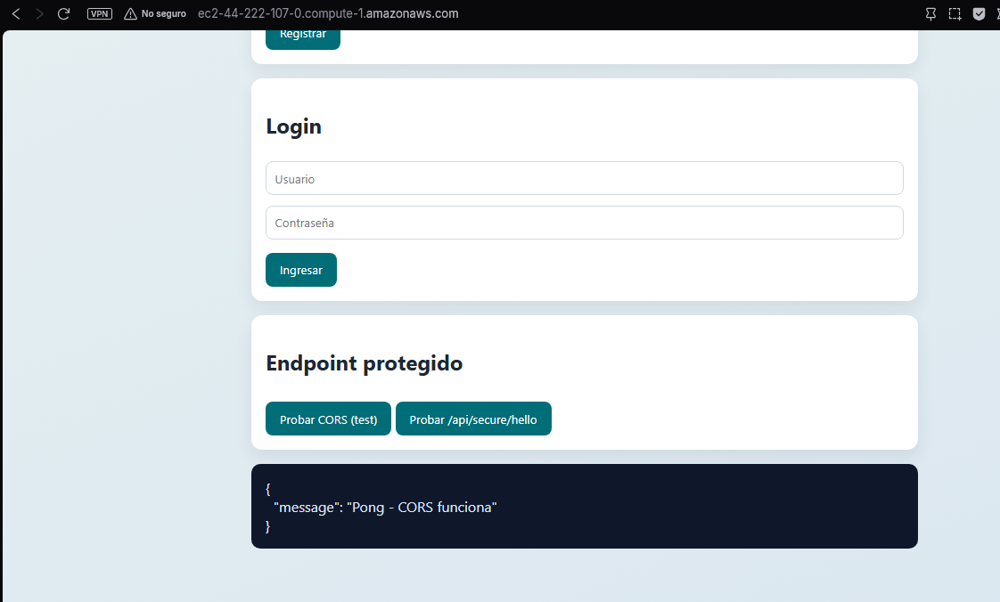
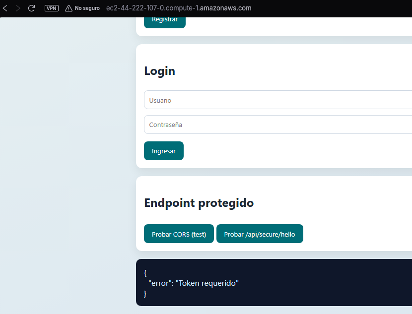
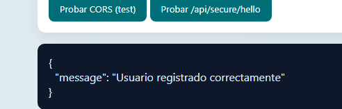

# Laboratorio - Secure Application Design

Este proyecto cumple el laboratorio con dos servidores en AWS:

- Servidor Apache (cliente web): ec2-44-222-107-0.compute-1.amazonaws.com
- Servidor Spring (API): ec2-54-146-31-33.compute-1.amazonaws.com:8443

## Que incluye

- Cliente web en Apache (HTML, CSS y JS)
- API REST en Spring Boot
- Registro y login
- Contrasenas hasheadas con BCrypt
- Endpoint protegido con token Bearer
- Conexion HTTPS entre cliente y API

## Estructura minima

- [apache-client/](apache-client/): interfaz web
- [spring-backend/](spring-backend/): backend y seguridad
- [docs/](docs/): comandos y guia del despliegue
- [images/](images/): evidencias de pruebas

## Como ejecutar el lab

1. Compilar backend:

```bash
cd spring-backend
mvn clean package -DskipTests
```

2. Seguir comandos de despliegue:
- [docs/comandos-copiar-pegar.md](docs/comandos-copiar-pegar.md)

3. Si necesitas explicacion paso a paso:
- [docs/deployment-aws-tls.md](docs/deployment-aws-tls.md)

## Endpoints usados

- `POST /api/auth/register`
- `POST /api/auth/login`
- `GET /api/secure/hello` (protegido por Bearer token)

## Nota sobre certificados

Durante las pruebas se uso certificado autofirmado en Spring, por eso el navegador puede mostrar advertencia de seguridad. Esto no afecta el flujo del laboratorio.

## Evidencias

1. CORS funcionando


2. Endpoint protegido sin token


3. Registro exitoso


4. Login exitoso (token)


5. Endpoint protegido con token valido

