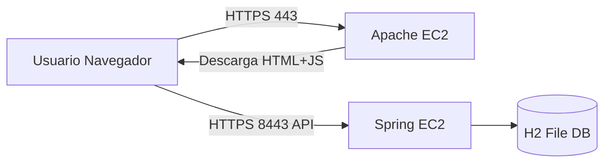

# Arquitectura de la Aplicacion

## Componentes

- Apache Server (EC2-1)
  - Sirve `index.html`, `app.js`, `styles.css` por HTTPS.
- Spring Server (EC2-2)
  - API REST por HTTPS en puerto 8443.
  - Registro y login.
  - Contraseñas con hash BCrypt.

## Diagrama

## Seguridad aplicada

- TLS en ambos servidores con certificados Let's Encrypt.
- Comunicación cifrada extremo a extremo.
- Password hashing con BCrypt.
- Endpoint protegido con token Bearer.
